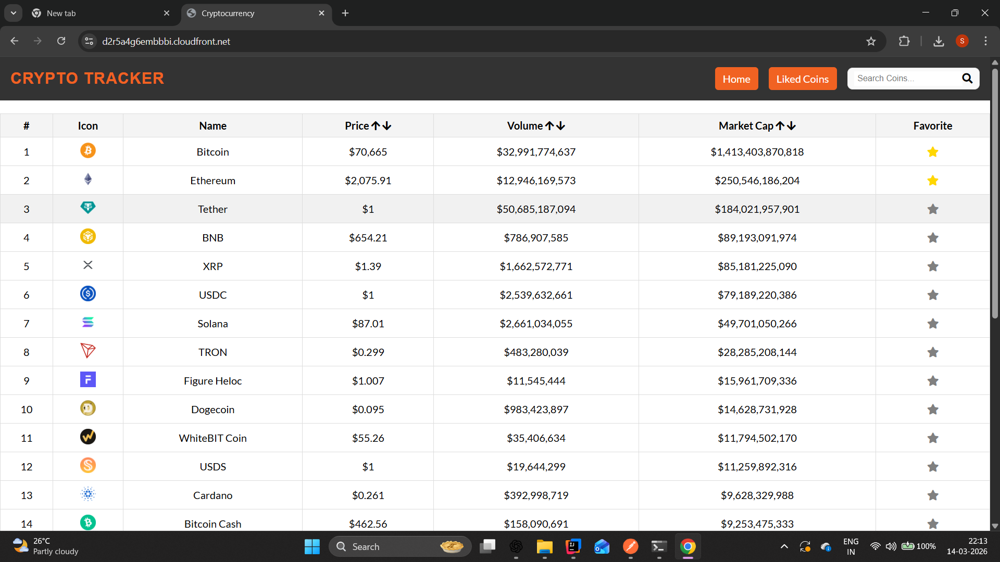
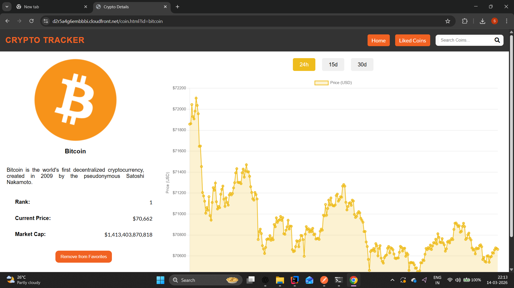
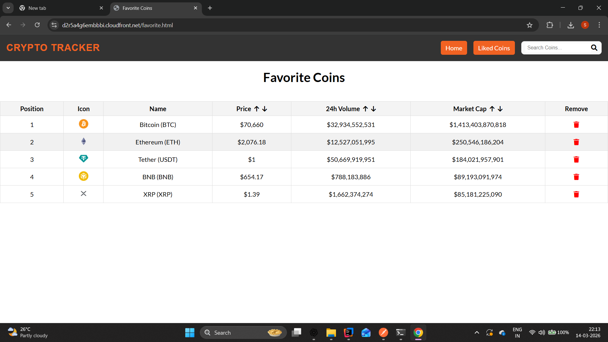

# 🚀 Crypto Tracker

A **real-time cryptocurrency tracking web application** that allows
users to view market data, analyze price trends, and manage favorite
coins.

The application fetches cryptocurrency data from public APIs and
provides a clean and interactive interface for monitoring cryptocurrency
markets.

## 🔗 Live Demo

https://d2r5a4g6embbbi.cloudfront.net/

------------------------------------------------------------------------

# 📊 Application Screenshots

## 🪙 Cryptocurrency Dashboard

The dashboard displays: - Top cryptocurrencies - Market capitalization -
24h trading volume - Current coin price - Favorite coin functionality

Users can also: - ⭐ Mark coins as favorites - 🔎 Search
cryptocurrencies - 🔃 Sort by price, volume, and market cap

------------------------------------------------------------------------

## 📈 Coin Detail & Price Chart

The coin details page provides: - Coin description - Current market
statistics - Market rank and capitalization - Interactive price chart -
Time filters (24h / 15d / 30d)

------------------------------------------------------------------------

## ⭐ Favorite Coins

Users can create a **personalized watchlist** by adding coins to
favorites.

Features: - Favorite coins table - Remove coins from favorites -
Persistent tracking across navigation

------------------------------------------------------------------------

# 🧠 Key Features

## 📊 Market Data Tracking

-   Real-time cryptocurrency data
-   Market cap, price, and volume tracking
-   Sortable columns

## ⭐ Favorites Management

-   Add coins to favorites
-   Dedicated favorites page
-   Remove coins from watchlist

## 📈 Interactive Charts

-   Coin price visualization
-   Multiple time ranges
-   Chart-based analysis

## 🔍 Search Functionality

-   Search coins instantly
-   Filter large coin lists efficiently

## 🎨 Clean UI/UX

-   Responsive design
-   Modern dark header layout
-   Structured data tables

------------------------------------------------------------------------

# 🏗️ System Architecture

    User Browser
         │
         ▼
    Static Frontend (HTML, CSS, JavaScript)
         │
         ▼
    External Crypto API
         │
         ▼
    Data Rendering (Tables + Charts)

## Deployment Architecture

    GitHub Repository
            │
            ▼
    AWS S3 (Static Website Hosting)
            │
            ▼
    AWS CloudFront (CDN Distribution)
            │
            ▼
    Global Users

------------------------------------------------------------------------

# ⚙️ Tech Stack

### Frontend

-   HTML5
-   CSS3
-   JavaScript (ES6)

### Visualization

-   Chart.js

### Cloud & Deployment

-   AWS S3
-   AWS CloudFront
-   GitHub

### Data Source

-   Cryptocurrency Market APIs

------------------------------------------------------------------------

# ☁️ Deployment

This project is deployed using **AWS S3 + CloudFront**.

### Deployment Steps

1.  Build static files
2.  Upload project to **S3 bucket**
3.  Enable **Static Website Hosting**
4.  Configure **CloudFront distribution**
5.  Set S3 bucket as origin
6.  Deploy globally via CDN

Live URL: https://d2r5a4g6embbbi.cloudfront.net/

------------------------------------------------------------------------

# 📂 Project Structure

    crypto-tracker
    │
    ├── index.html
    ├── favorite.html
    ├── coin.html
    │
    ├── css
    │   └── styles.css
    │
    ├── js
    │   ├── main.js
    │   ├── favorites.js
    │   └── coinDetails.js
    │
    ├── assets
    │   └── icons
    │
    └── README.md

------------------------------------------------------------------------

# 📌 Future Improvements

-   🔐 User authentication
-   📊 Advanced technical indicators
-   📱 Mobile optimized UI
-   🔔 Price alerts
-   💼 Portfolio tracking

------------------------------------------------------------------------

# 👨‍💻 Author

**Sparsh Chaudhari**\
Java Backend Developer \| Spring Boot \| Microservices

GitHub: https://github.com/sparshpro\
LinkedIn: https://linkedin.com/in/sparshpro

------------------------------------------------------------------------

# ⭐ Support

If you like this project, consider giving it a ⭐ on GitHub.
